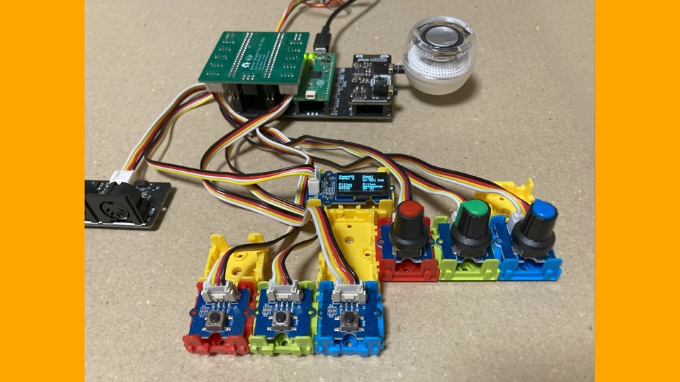
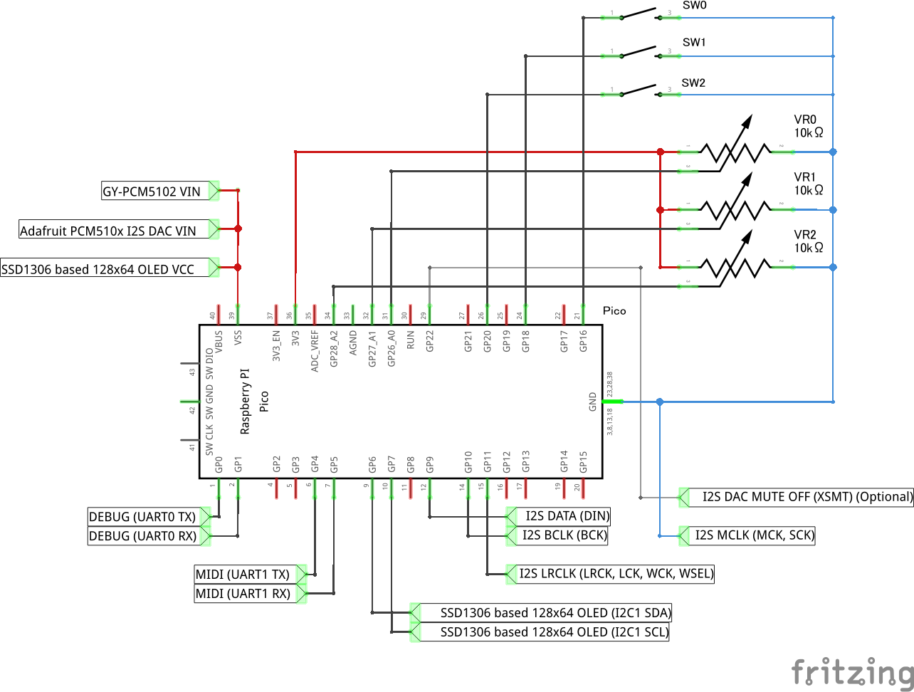
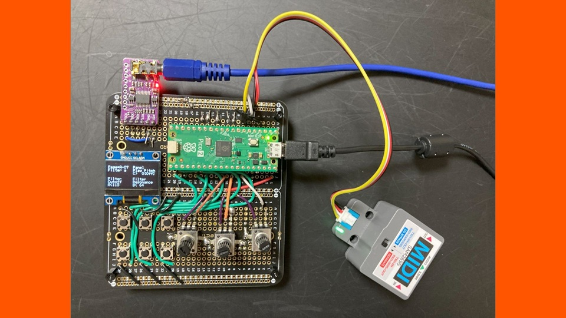
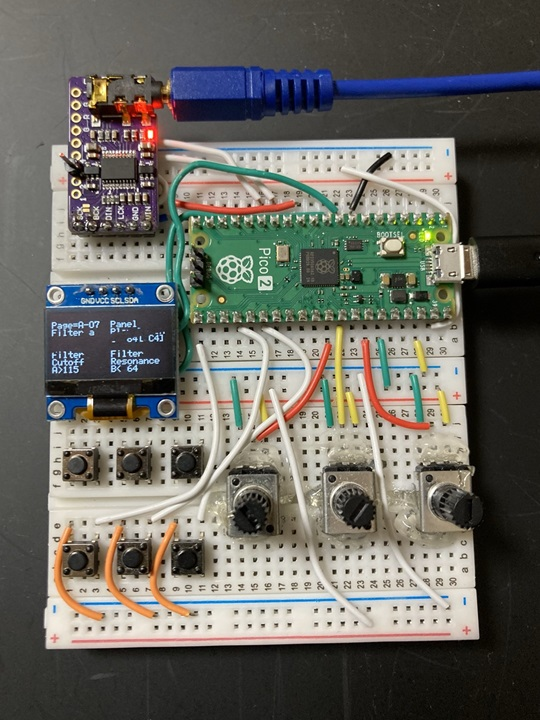

# Digital Synth PRA32-U2/P v3.11.0

- 2026-10-10 ISGK Instruments
- <https://github.com/risgk/digital-synth-pra32-u2>

## PRA32-U2/P (PRA32-U2 with Panel) (Optional)

- Features
    - Editing and displaying parameters by panel operation
    - Playing by panel operation
    - Built-in monophonic 8-step sequencer
    - Panel and Step Sequencer Parameters
- This option requires 1 to 4 SWs (tactile switches), 2 to 3 VRs (ADCs), and a monochrome 128x64 OLED Display based on SSD1306 series drivers
    - Tested with Pimoroni Pico Audio Pack, M5Stack MIDI Unit (optional), Long Leg 2x20 Pin Socket * 2, Seeed Studio's Grove Shield for Pi Pico, Dual Button * 3, Rotary Angle Sensor * 3, and an OLED Display 0.96 inch
- Uncomment out `//#define PRA32_U2_USE_CONTROL_PANEL` in "Digital-Synth-PRA32-U2.ino" and modify the constants
- Inputs
    - SW0: Prev Key (Push to go to the previous page, Long press to the previous group)
    - SW1: Next Key (Push to go to the next page, Long press to the next group)
    - SW2: Play Key (Normal Mode: press to play, Sequencer Mode: push to start/stop) (Removable)
        - Not to use this key, comment out `#define PRA32_U2_KEY_INPUT_PLAY_KEY_PIN          (20)` in "Digital-Synth-PRA32-U2.ino"
    - SW3: Prog - Key (Long press to change to the previous user program) (optional)
        - To use this key, uncomment out `//#define PRA32_U2_KEY_INPUT_PROG_MINUS_KEY_PIN    (17)` in "Digital-Synth-PRA32-U2.ino"
    - SW4: Prog + Key (Long press to change to the next user program) (optional)
        - To use this key, uncomment out `//#define PRA32_U2_KEY_INPUT_PROG_PLUS_KEY_PIN     (19)` in "Digital-Synth-PRA32-U2.ino"
    - SW5: Shift Key (optional)
        - Shift + Prev/Next Key: Go to the previous/next group without long-pressing
        - Shift + Prog -/+ Key: Change to the previous/next user program without long-pressing
        - Shift + VR0/1/2: Prevent values from changing across 64
        - To use this key, uncomment out `//#define PRA32_U2_KEY_INPUT_SHIFT_KEY_PIN         (21)` in "Digital-Synth-PRA32-U2.ino"
    - VR0 (ADC0): Parameter A
    - VR1 (ADC1): Parameter B
    - VR2 (ADC2): Parameter C for Play (Removable)
        - Panel Play Pitch in Normal Mode, Seq Pitch Ofst (Offset) in Step Sequencer Mode
        - Not to use this, comment out `#define PRA32_U2_KEY_INPUT_PLAY_KEY_PIN          (20)` in "Digital-Synth-PRA32-U2.ino"
- NOTE: Using a USB cable with ferrite cores is recommended to prevent ADCs from being affected by USB MIDI communication noise, and UART MIDI control is also recommended

### PRA32-U2/M/P (PRA32-U2 Multi-Timbre Edition with Panel) (Optional)

- Copy all files in the "Digital-Synth-PRA32-U2" folder, except for "Digital-Synth-PRA32-U2.ino", to the "Digital-Synth-PRA32-U2-M" folder
- Uncomment out `//#define PRA32_U2_USE_CONTROL_PANEL` in "Digital-Synth-PRA32-U2-M.ino"
- Prev Key + Next Key: Push to go to the next synth (channel)
    - "$0" -> "$1" -> "$2" -> "$3" -> "$D" -> "$E" -> "$F" -> "$0"
    - "$0" to "$3": Basic Channel + 0 to + 3 (Synths)
    - "$D" to "$F": Basic Channel - 3 to - 1 (Layering)

### GUI Pages

#### Group A

- Synth Parameters
    - NOTE: The parameters Filter EG Amt and EG Filter Amt are the same

#### Group B

- Panel Parameters
    - Panel Play Mode [Nrm|Seq]: Normal Mode, Step Sequencer Mode
    - MIDI Basic Ch: Basic Channel 1-16
    - Panel Play Pitch: 0 is Off, 1-4 is lowest, 124-127 is highest
    - Panel Play Velo (Velocity)
    - Panel Scale [Maj|Min|Mel|MaP|MiP|Chr]: Major, Natural Minor, Ascending Melodic Minor (Jazz Minor), Major Pentatonic, Minor Pentatonic, Chromatic (2 octaves)
    - Panel Pitch Ofst (Offset) [-|+]: Offset Panel Play Pitch and Seq Pitch 0-7 (min -60 to max +60)
        - For example, if Panel Scale is Maj and Panel Pitch Ofst is -25, the scale is G Mixolydian
        - For example, if Panel Scale is Maj and Panel Pitch Ofst is -15, the scale is A Aeolian (Natural Minor)
        - For example, if Panel Scale is Maj and Panel Pitch Ofst is +10, the scale is D Dorian
        - For example, if Panel Scale is Maj and Panel Pitch Ofst is +20, the scale is E Phrygian
        - For example, if Panel Scale is Maj and Panel Pitch Ofst is +25, the scale is F Lydian
    - Panel Transpose [-|+]
        - For example, if Panel Scale is Mel and Panel Transpose is -3, the scale is A Ascending Melodic Minor (Jazz Minor)
        - For example, if Panel Scale is Min and Panel Transpose is -3, the scale is A Natural Minor
        - For example, if Panel Scale is MiP and Panel Transpose is -3, the scale is A Minor Pentatonic
- Step Sequencer Parameters
    - Seq Step Note [4|8|16]: Quarter Note, Eighth Note, Sixteenth Note
    - Seq Clock Src [Int|Ext]: Internal, External (Rx MIDI Clock)
    - Seq Pitch Ofst (Offset) [-|+]: Offset Seq Pitch 0-7 (min -60 to max +60)
    - Seq T/Rx St/Sp (Transmit/Receive Start/Stop): Off, On
    - Seq Tempo: 30-240 BPM
    - Seq Gate Time [1/6|2/6|3/6|4/6|5/6|6/6]
    - Seq Mode [Fwd|Rvs|Bnc]: Forward, Reverse, Bounce
    - Seq Num Steps (Number of Steps): 1-32 (current step mod 8 is used as the index for Seq Pitch and Seq Velo)
    - Seq On Steps: bit 0 is Step 1 On, ..., bit 6 is Step 7 On (Step 0 is always On)
    - Seq Act Steps (Active Steps): bit 0 is Step 1 Active, ..., bit 6 is Step 7 Active (Step 0 is always Active)
    - Seq Pitch 0-7: 0 is Off, 1-4 is lowest, 124-127 is highest
    - Seq Velo 0-7 (Velocity 0-7)
- Step Sequencer Operations
    - Seq Rand Pitch (Randomize Pitch 0-7): Change the value from 0-32 [Rdy] to 96-127 [Exe]
    - Seq Rand Velo (Randomize Velo 0-7): Change the value from 0-32 [Rdy] to 96-127 [Exe]
- Control Parameters
    - Modulation
    - Breath Controller
    - Sustain Pedal
- Control Operations
    - Panic: Change the value from 0-32 [Rdy] to 96-127 [Exe]
    - Randomize Synth (Randomize Synth Parameters, as Program Change #127): Change the value from 0-32 [Rdy] to 96-127 [Exe]

#### Group C

- Write Operations
    - Write #0-15 (User), Write Panel Prms (Write Panel and Step Sequencer Parameters)
        - Change the value from 0-32 [Rdy] to 96-127 [Exe] to write to the flash

#### Group D

- Read Operations
    - Read #0-15 (User), #16-31 (Factory Presets), Read Panel Prms, Init Panel Prms
        - Change the value from 0-32 [Rdy] to 96-127 [Exe] to read from the flash

### Circuit Diagram

- This image was created with Fritzing.
    - Actually, it is necessary to use Raspberry Pi Pico 2 (instead of Raspberry Pi Pico)
- NOTE: Unlike Digital Synth PRA32-U v3.1.0, the switches are low active and RP2350 uses internal pull-up to avoid RP2350-E9 Erratum

### An Example of Construction Using a Universal PCB

- Using a universal PCB, GY-PCM5102 (PCM5102A I2S DAC Module), 6 SWs, 3 VRs, a OLED Display, and a M5Stack MIDI Unit (optional)
    - An connection between Raspberry Pico 2's Mute Off Pin and GY-PCM5102's XSMT is omitted

### An Example of Construction Using a Breadboard

- Using a breadboard, GY-PCM5102 (PCM5102A I2S DAC Module), 3 SWs, 3 VRs, and a OLED Display
    - An connection between Raspberry Pico 2's Mute Off Pin and GY-PCM5102's XSMT is omitted

### Table of GUI Pages

| Page           | Parameter A          | Parameter B          |
| :------------- | :------------------- | :------------------- |
| A-00 Info      | PRA32-U2/P           | v3.11.0              |
| A-01 Voice     | Voice Mode           | Voice Asgn Mode      |
| A-02 Pitch a   | Portamento           | Pitch Bend Range     |
| A-03 Pitch b   | Stretch Tune         |                      |
| A-04 Pitch c   | Coarse Tune          | Fine Tune            |
| A-05 Osc a     | Osc 1 Wave           | Mixer Noise/Sub      |
| A-06 Osc b     | Osc 1 Shape          | Osc 1 Morph          |
| A-07 Osc c     | Osc 2 Wave           | Mixer Osc Mix        |
| A-08 Osc d     | Osc 2 Coarse         | Osc 2 Pitch          |
| A-09 Osc e     | Osc/Filter Drift     | Osc Saw W Mode       |
| A-10 Filter a  | Filter Cutoff        | Filter Resonance     |
| A-11 Filter b  | Filter EG Amt        | Filter Key Track     |
| A-12 Filter c  | Filter Mode          |                      |
| A-13 EG a      | EG Attack            | EG Decay             |
| A-14 EG b      | EG Sustain           | EG Release           |
| A-15 EG c      | EG Amp Mod           | EG/Amp Rel = Dec     |
| A-16 EG d      | EG Mod Amt           | EG Mod Dst           |
| A-17 EG e      | EG Filter Amt        | EG Level Velo Sens   |
| A-18 EG f      | EG Att/Dec Velo Sens | EG Rel Velo Sens     |
| A-19 EG g      | EG Att/Dec Key Track |                      |
| A-20 Amp a     | Amp Attack           | Amp Decay            |
| A-21 Amp b     | Amp Sustain          | Amp Release          |
| A-22 Amp c     | Amp Gain             | Amp Level Velo Sens  |
| A-23 Panner    | Pan                  |                      |
| A-24 LFO a     | LFO Wave             | LFO Fade Time        |
| A-25 LFO b     | LFO Rate             | LFO Depth            |
| A-26 LFO c     | LFO Mod Amt          | LFO Mod Dst          |
| A-27 LFO d     | LFO Filter Amt       |                      |
| A-28 Breath    | Breath Filter Amt    | Breath Amp Mode      |
| A-29 Aft Touch | Aft Touch LFO Amt    |                      |
| A-30 Chorus a  | Chorus Level         | FX Routing           |
| A-31 Chorus b  | Chorus Rate          | Chorus Depth         |
| A-32 Delay a   | Delay Level          | Delay Mode           |
| A-33 Delay b   | Delay Time           | Delay Feedback       |
| B-00 Panel a   | Panel Play Mode      | MIDI Basic Ch        |
| B-01 Panel b   | Panel Play Pitch     | Panel Play Velo      |
| B-02 Panel c   | Panel Scale          | Panel Pitch Ofst     |
| B-03 Panel d   | Panel Transpose      |                      |
| B-04 Seq a     | Seq Step Note        | Seq Clock Src        |
| B-05 Seq b     | Seq Transpose        | Seq T/Rx St/Sp       |
| B-06 Seq c     | Seq Tempo            | Seq Gate Time        |
| B-07 Seq d     | Seq Mode             | Seq Num Steps        |
| B-08 Seq e     | Seq On Steps         | Seq Act Steps        |
| B-09 Seq f     | Seq Rand Pitch       | Seq Rand Velo        |
| B-10 Seq 0     | Seq Pitch 0          | Seq Velo 0           |
| B-11 Seq 1     | Seq Pitch 1          | Seq Velo 1           |
| B-12 Seq 2     | Seq Pitch 2          | Seq Velo 2           |
| B-13 Seq 3     | Seq Pitch 3          | Seq Velo 3           |
| B-14 Seq 4     | Seq Pitch 4          | Seq Velo 4           |
| B-15 Seq 5     | Seq Pitch 5          | Seq Velo 5           |
| B-16 Seq 6     | Seq Pitch 6          | Seq Velo 6           |
| B-17 Seq 7     | Seq Pitch 7          | Seq Velo 7           |
| B-18 Control a | Modulation           | Expression           |
| B-19 Control b | Breath Controller    | Sustain Pedal        |
| B-20 Control c | Panic                | Randomize Synth      |
| C-00 Write 0   | Write #0 User        | Write #1 User        |
| C-01 Write 2   | Write #2 User        | Write #3 User        |
| C-02 Write 4   | Write #4 User        | Write #5 User        |
| C-03 Write 6   | Write #6 User        | Write #7 User        |
| C-04 Write 8   | Write #8 User        | Write #9 User        |
| C-05 Write 10  | Write #10 User       | Write #11 User       |
| C-06 Write 12  | Write #12 User       | Write #13 User       |
| C-07 Write 14  | Write #14 User       | Write #15 User       |
| C-08 Write a   | Write Panel Prms     |                      |
| D-00 Read 0    | Read #0 User         | Read #1 User         |
| D-01 Read 2    | Read #2 User         | Read #3 User         |
| D-02 Read 4    | Read #4 User         | Read #5 User         |
| D-03 Read 6    | Read #6 User         | Read #7 User         |
| D-04 Read 8    | Read #8 User         | Read #9 User         |
| D-05 Read 10   | Read #10 User        | Read #11 User        |
| D-06 Read 12   | Read #12 User        | Read #13 User        |
| D-07 Read 14   | Read #14 User        | Read #15 User        |
| D-08 Read 16   | Read #16 Synth Pad   | Read #17 M Saw Pad   |
| D-09 Read 18   | Read #18 FM Piano    | Read #19 Plain Poly  |
| D-10 Read 20   | Read #20 Saw Lead    | Read #21 Sync Lead   |
| D-11 Read 22   | Read #22 Synth Bass  | Read #23 Initial     |
| D-12 Read 24   | Read #24 Synth Brs   | Read #25 Synth Str   |
| D-13 Read 26   | Read #26 WT Pad      | Read #27 Elec Organ  |
| D-14 Read 28   | Read #28 Fifth Lead  | Read #29 Sqr Lead    |
| D-15 Read 30   | Read #30 PWM Lead    | Read #31 ---         |
| D-16 Read a    | Read Panel Prms      | Init Panel Prms      |
