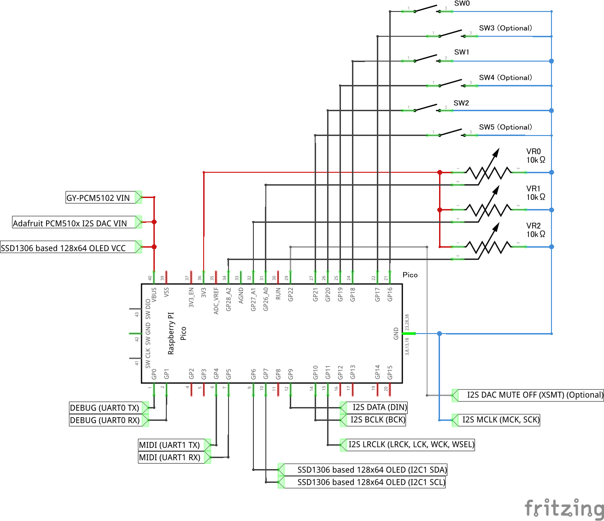
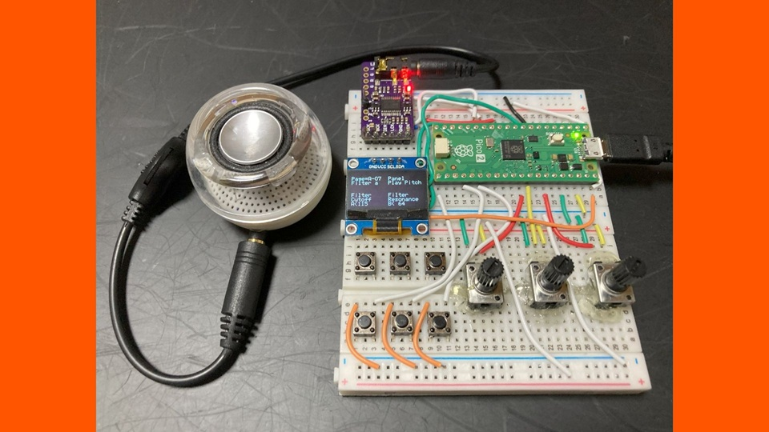

# Digital Synth PRA32-U2 with Panel v1.6.0

- 2025-12-19 ISGK Instruments
- <https://github.com/risgk/digital-synth-pra32-u2>

## PRA32-U2 with Panel (Optional)

- Features
    - Editing and displaying parameters by panel operation
    - Playing by panel operation
    - Built-in monophonic 8-step sequencer
    - Panel and Step Sequencer Parameters
- This option requires 1 to 4 SWs (tactile switches), 2 to 3 VRs (ADCs), and a monochrome 128x64 OLED Display based on SSD1306 series drivers
    - Tested with Pimoroni Pico Audio Pack, M5Stack MIDI Unit (optional), Long Leg 2x20 Pin Socket * 2, Seeed Studio's Grove Shield for Pi Pico, Dual Button * 3, Rotary Angle Sensor * 3, and an OLED Display 0.96 inch
- Uncomment out `//#define PRA32_U2_USE_CONTROL_PANEL` in "Digital-Synth-PRA32-U2.ino" and modify the constants
- Inputs
    - SW0: Prev Key (Push to go to the previous page, Long press to the previous group)
    - SW1: Next Key (Push to go to the next page, Long press to the next group)
    - SW2: Play Key (Normal Mode: press to play, Sequencer Mode: push to start/stop) (omittable)
        - To not use this key, comment out `#define PRA32_U2_KEY_INPUT_PLAY_KEY_PIN          (20)` in "Digital-Synth-PRA32-U2.ino"
    - SW3: Prog - Key (Push to change to the previous user program) (optional)
        - To use this key, uncomment out `//#define PRA32_U2_KEY_INPUT_PROG_MINUS_KEY_PIN    (17)` in "Digital-Synth-PRA32-U2.ino"
    - SW4: Prog + Key (Push to change to the next user program) (optional)
        - To use this key, uncomment out `//#define PRA32_U2_KEY_INPUT_PROG_PLUS_KEY_PIN     (19)` in "Digital-Synth-PRA32-U2.ino"
    - SW5: Shift Key (Press to prevent values from changing across 64) (optional)
        - To use this key, uncomment out `//#define PRA32_U2_KEY_INPUT_SHIFT_KEY_PIN         (21)` in "Digital-Synth-PRA32-U2.ino"
    - VR0 (ADC0): Parameter A
    - VR1 (ADC1): Parameter B
    - VR2 (ADC2): Parameter C for Play (omittable)
        - Panel Play Pitch in Normal Mode, Seq Pitch Ofst (Offset) in Step Sequencer Mode
        - To not use this, comment out `#define PRA32_U2_KEY_INPUT_PLAY_KEY_PIN          (20)` in "Digital-Synth-PRA32-U2.ino"
- NOTE: Using a USB cable with ferrite cores is recommended to prevent ADCs from being affected by USB MIDI communication noise, and UART MIDI control is also recommended

### GUI Pages

#### Group A

- Synth Parameters
    - NOTE: The parameters Filter EG Amt and EG Filter Amt are the same

#### Group B

- Panel Parameters
    - Panel Play Mode [Nrm|Seq]: Normal Mode, Step Sequencer Mode
    - Panel MIDI Ch: Basic Channel 1-16
    - Panel Play Pitch: 0 is Off, 1-4 is lowest, 124-127 is highest
    - Panel Play Velo (Velocity)
    - Panel Scale [Maj|Min|Mel|MaP|MiP|Chr]: Major, Natural Minor, Ascending Melodic Minor (Jazz Minor), Major Pentatonic, Minor Pentatonic, Chromatic (2 octaves)
    - Panel Pitch Ofst (Offset) [-|+]: Offset Panel Play Pitch and Seq Pitch 0-7 (min -60 to max +60)
        - For example, if Panel Scale is Maj and Panel Pitch Ofst is -25, the scale is G Mixolydian
        - For example, if Panel Scale is Maj and Panel Pitch Ofst is -15, the scale is A Aeolian (Natural Minor)
        - For example, if Panel Scale is Maj and Panel Pitch Ofst is +10, the scale is D Dorian
        - For example, if Panel Scale is Maj and Panel Pitch Ofst is +20, the scale is E Phrygian
        - For example, if Panel Scale is Maj and Panel Pitch Ofst is +25, the scale is F Lydian
    - Panel Transpose [-|+]
        - For example, if Panel Scale is Mel and Panel Transpose is -3, the scale is A Ascending Melodic Minor (Jazz Minor)
        - For example, if Panel Scale is Min and Panel Transpose is -3, the scale is A Natural Minor
        - For example, if Panel Scale is MiP and Panel Transpose is -3, the scale is A Minor Pentatonic
- Step Sequencer Parameters
    - Seq Step Note [4|8|16]: Quarter Note, Eighth Note, Sixteenth Note
    - Seq Clock Src [Int|Ext]: Internal, External (Rx MIDI Clock)
    - Seq Pitch Ofst (Offset) [-|+]: Offset Seq Pitch 0-7 (min -60 to max +60)
    - Seq T/Rx St/Sp (Transmit/Receive Start/Stop): Off, On
    - Seq Tempo: BPM 56-300
    - Seq Gate Time [1/6|2/6|3/6|4/6|5/6|6/6]
    - Seq Mode [Fwd|Rvs|Bnc]: Forward, Reverse, Bounce
    - Seq Num Steps (Number of Steps): 1-32 (current step mod 8 is used as the index for Seq Pitch and Seq Velo)
    - Seq On Steps: bit 0 is Step 1 On, ..., bit 6 is Step 7 On (Step 0 is always On)
    - Seq Act Steps (Active Steps): bit 0 is Step 1 Active, ..., bit 6 is Step 7 Active (Step 0 is always Active)
    - Seq Pitch 0-7: 0 is Off, 1-4 is lowest, 124-127 is highest
    - Seq Velo 0-7 (Velocity 0-7)
- Step Sequencer Operations
    - Seq Rand Pitch (Randomize Pitch 0-7): Change the value from 0-63 [Rdy] to 64-127 [Exe]
    - Seq Rand Velo (Randomize Velo 0-7): Change the value from 0-63 [Rdy] to 64-127 [Exe]
- Control Parameters
    - Modulation
    - Breath Controller
    - Sustain Pedal

#### Group C

- Write Operations
    - Write Program 0-7, Write Panel Prms (Write Panel and Step Sequencer Parameters)
        - Change the value from 0-63 [Rdy] to 64-127 [Exe] to write to the flash

#### Group D

- Read Operations
    - Read Program 1-7, 8-15, Read Panel Prms, Init Panel Prms
        - Change the value from 0-63 [Rdy] to 64-127 [Exe] to read from the flash

### Circuit Diagram

- This image was created with Fritzing.
    - Actually, it is necessary to use Raspberry Pi Pico 2 (instead of Raspberry Pi Pico)
- NOTE: Unlike Digital Synth PRA32-U v3.1.0, the switches are low active and RP2350 uses internal pull-up to avoid RP2350-E9 Erratum

### An Example of Construction Using a Universal PCB

- Using a universal PCB, GY-PCM5102 (PCM5102A I2S DAC Module), 6 SWs, 3 VRs, a OLED Display, and a M5Stack MIDI Unit (optional)
    - An connection between Raspberry Pico 2's Mute Off Pin and GY-PCM5102's XSMT is omitted

### An Example of Construction Using a Breadboard

- Using a breadboard, GY-PCM5102 (PCM5102A I2S DAC Module), 3 SWs, 3 VRs, and a OLED Display
    - An connection between Raspberry Pico 2's Mute Off Pin and GY-PCM5102's XSMT is omitted

### Table of GUI Pages

| Page           | Parameter A         | Parameter B      |
| :------------- | :------------------ | :--------------- |
| A-00 Info      | PRA32-U2 with Panel | v1.6.0           |
| A-01 Voice     | Voice Mode          | Voice Asgn Mode  |
| A-02 Pitch     | Portamento          | Pitch Bend Range |
| A-03 Osc a     | Osc 1 Wave          | Mixer Noise/Sub  |
| A-04 Osc b     | Osc 1 Shape         | Osc 1 Morph      |
| A-05 Osc c     | Osc 2 Wave          | Mixer Osc Mix    |
| A-06 Osc d     | Osc 2 Coarse        | Osc 2 Pitch      |
| A-07 Filter a  | Filter Cutoff       | Filter Resonance |
| A-08 Filter b  | Filter EG Amt       | Filter Key Track |
| A-09 Filter c  | Filter Mode         |                  |
| A-10 EG a      | EG Attack           | EG Decay         |
| A-11 EG b      | EG Sustain          | EG Release       |
| A-12 EG c      | EG Amp Mod          | Release = Decay  |
| A-13 EG d      | EG Mod Amt          | EG Mod Dst       |
| A-14 EG e      | EG Filter Amt       | EG Velo Sens     |
| A-15 Amp a     | Amp Attack          | Amp Decay        |
| A-16 Amp c     | Amp Sustain         | Amp Release      |
| A-17 Amp b     | Amp Gain            | Amp Velo Sens    |
| A-18 LFO a     | LFO Wave            | LFO Fade Time    |
| A-19 LFO b     | LFO Rate            | LFO Depth        |
| A-20 LFO c     | LFO Mod Amt         | LFO Mod Dst      |
| A-21 LFO d     | LFO Filter Amt      |                  |
| A-22 Breath    | Breath Filter Amt   | Breath Amp Mod   |
| A-23 Chorus a  | Chorus Mix          |                  |
| A-24 Chorus b  | Chorus Rate         | Chorus Depth     |
| A-25 Delay a   | Delay Level         | Delay Mode       |
| A-26 Delay b   | Delay Time          | Delay Feedback   |
| B-00 Panel a   | Panel Play Mode     | Panel MIDI Ch    |
| B-01 Panel b   | Panel Play Pitch    | Panel Play Velo  |
| B-02 Panel c   | Panel Scale         | Panel Pitch Ofst |
| B-03 Panel d   | Panel Transpose     |                  |
| B-04 Seq a     | Seq Step Note       | Seq Clock Src    |
| B-05 Seq b     | Seq Transpose       | Seq T/Rx St/Sp   |
| B-06 Seq c     | Seq Tempo           | Seq Gate Time    |
| B-07 Seq d     | Seq Mode            | Seq Num Steps    |
| B-08 Seq e     | Seq On Steps        | Seq Act Steps    |
| B-09 Seq f     | Seq Rand Pitch      | Seq Rand Velo    |
| B-10 Seq 0     | Seq Pitch 0         | Seq Velo 0       |
| B-11 Seq 1     | Seq Pitch 1         | Seq Velo 1       |
| B-12 Seq 2     | Seq Pitch 2         | Seq Velo 2       |
| B-13 Seq 3     | Seq Pitch 3         | Seq Velo 3       |
| B-14 Seq 4     | Seq Pitch 4         | Seq Velo 4       |
| B-15 Seq 5     | Seq Pitch 5         | Seq Velo 5       |
| B-16 Seq 6     | Seq Pitch 6         | Seq Velo 6       |
| B-17 Seq 7     | Seq Pitch 7         | Seq Velo 7       |
| B-18 Control a | Modulation          |                  |
| B-19 Control b | Breath Controller   | Sustain Pedal    |
| C-00 Write 0   | Write Program 0     | Write Program 1  |
| C-01 Write 2   | Write Program 2     | Write Program 3  |
| C-02 Write 4   | Write Program 4     | Write Program 5  |
| C-03 Write 6   | Write Program 6     | Write Program 7  |
| C-04 Write a   | Write Panel Prms    |                  |
| D-00 Read 0    | Read Program 0      | Read Program 1   |
| D-01 Read 2    | Read Program 2      | Read Program 3   |
| D-02 Read 4    | Read Program 4      | Read Program 5   |
| D-03 Read 6    | Read Program 6      | Read Program 7   |
| D-04 Read 8    | Read Program 8      | Read Program 9   |
| D-05 Read 10   | Read Program 10     | Read Program 11  |
| D-06 Read 12   | Read Program 12     | Read Program 13  |
| D-07 Read 14   | Read Program 14     | Read Program 15  |
| D-08 Read a    | Read Panel Prms     | Init Panel Prms  |
