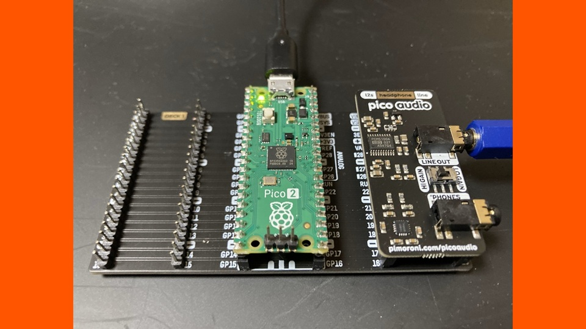
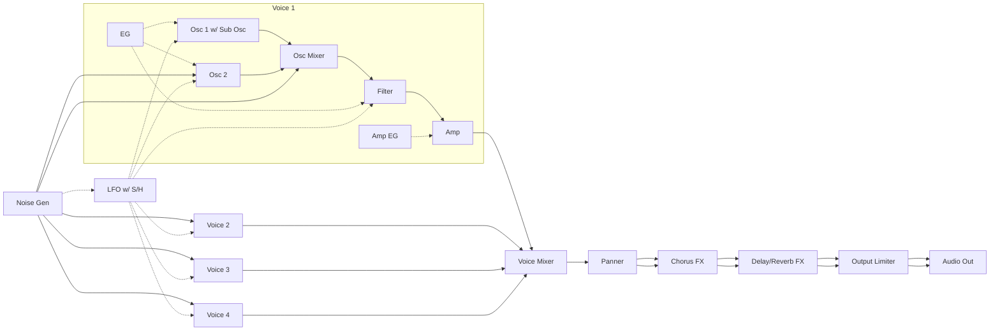
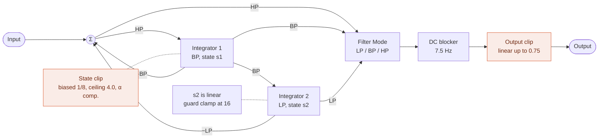
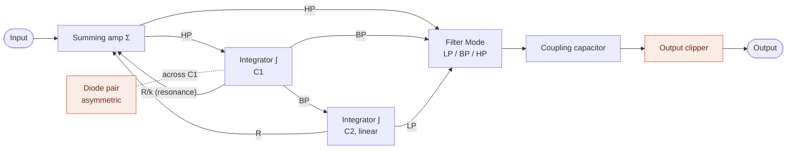
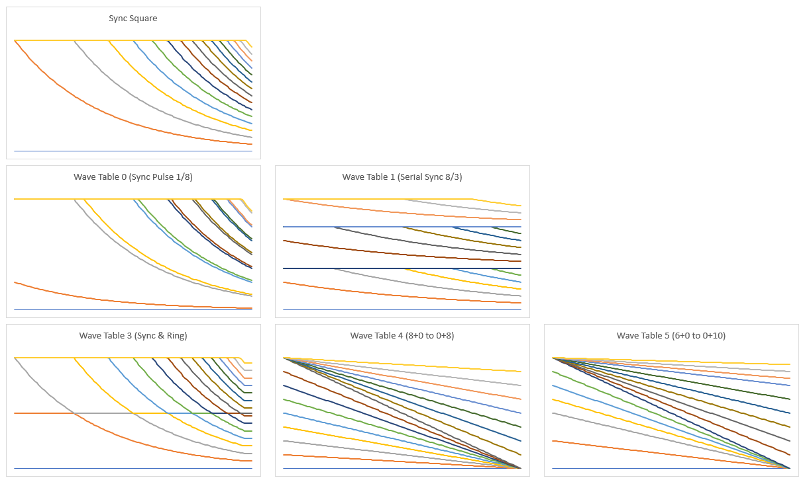
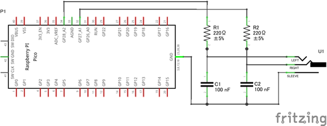
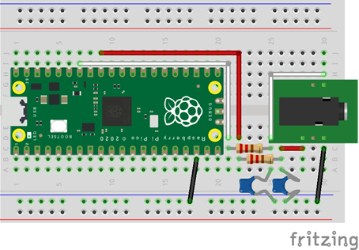

# Digital Synth PRA32-U2 v3.8.0

- 2026-09-22 ISGK Instruments
- <https://github.com/risgk/digital-synth-pra32-u2>


## Overview

- **PRA32-U2** is a 4-Voice Polyphonic Synthesizer for Raspberry Pi Pico 2/RP2350
    - Built-in Chorus and Delay/Reverb FX, followed by the Output Limiter
    - Controlled by MIDI -- PRA32-U2 is a MIDI sound module
    - Having the function of writing the parameters to the user programs and the flash
    - PRA32-U2 is an upgraded model of PRA32-U (for Raspberry Pi Pico/RP2040), but some specifications differ
- Modifiable with Arduino IDE and Arduino-Pico (by Earle F. Philhower, III)
- An **I2S DAC** hardware (e.g. Pimoroni Pico Audio Pack) is required
- Optional
    - **[PRA32-U2/M](#pra32-u2m-pra32-u2-multi-timbre-edition-optional)** (PRA32-U2 Multi-Timbre Edition) can also be configured
    - **[PRA32-U2/P](./README-PRA32-U2-P.md)** (PRA32-U2 with Panel) and **PRA32-U2/M/P** (PRA32-U2 Multi-Timbre Edition with Panel) can also be configured by adding certain parts
    - **[PRA32-U2/E](#pra32-u2e-pra32-u2m-for-m5stack-atoms3-lite-experimental-optional)** (PRA32-U2/M for M5Stack AtomS3 Lite) is an experimental port to ESP32-S3
- Prebuilt UF2 files (in the "bin" folder)
    - PRA32-U2/M (Recommended): "Digital-Synth-PRA32-U2-M-Pimoroni-Pico-Audio-Pack.uf2" is for Raspberry Pi Pico 2 and Pimoroni Pico Audio Pack
        - A superset of PRA32-U2: the Main Synth (Basic Channel + 0) works the same as PRA32-U2, and the Sub Synths and Layering are added
        - NOTE: It also responds to MIDI Channels 2-4 and 14-16 (by default); use PRA32-U2 if these channels are used for other devices
    - PRA32-U2: "Digital-Synth-PRA32-U2-Pimoroni-Pico-Audio-Pack.uf2" is for Raspberry Pi Pico 2 and Pimoroni Pico Audio Pack




## [Change History](./PRA32-U2-Change-History.md)


## [Parameter Guide](./PRA32-U2-Parameter-Guide.md)


## [MIDI Implementation Chart](./PRA32-U2-MIDI-Implementation-Chart.md)


## Synthesizer Block Diagram


```mermaid
graph LR
    subgraph V1[Voice 1]
        V1O1[Osc 1 w/ Sub Osc] --> V1OM[Osc Mixer]
        V1O2[Osc 2] --> V1OM
        V1OM --> V1F[Filter]
        V1F --> V1A[Amp]
        E[EG] -.-> V1O1 & V1O2 & V1F
        V1AE[Amp EG] -.-> V1A
    end
    V1A --> VM[Voice Mixer]
    V2[Voice 2] & V3[Voice 3] & V4[Voice 4] --> VM
    VM --> P[Panner] --> C[Chorus FX] --> D[Delay/Reverb FX] --> OL[Output Limiter] --> AO[Audio Out]
    P --> C --> D --> OL --> AO
    N[Noise Gen]  --> V1O2 & V1OM & V2 & V3 & V4
    N -.-> L[LFO w/ S/H]
    L -.-> V1O1 & V1O2 & V1F & V2 & V3 & V4
```


## Filter Diagrams

A zero-delay feedback state variable filter: at the sum, the loop equation is solved in closed
form, so the high pass is found in one step. The soft clip acts only where the band pass state
is read back, and it is what holds the resonance down; the low pass state stays linear, with a
clamp at 16 as a guard that ordinary use never reaches. The soft clip is biased by 1/8, so that
it adds even harmonics as the band pass state is driven (at a high Resonance or near the
cutoff), with its small-signal gain made up for, so that the resonance is kept; a DC blocker on
the output removes the DC that comes with it. The output clip comes last. Above the Filter
Resonance 122, k turns negative and the loop oscillates.


```mermaid
flowchart LR
    IN([Input]) --> SUM((Σ))
    SUM -->|HP| I1["Integrator 1<br/>BP, state s1"]
    I1 -->|BP| I2["Integrator 2<br/>LP, state s2"]
    SUM -->|HP| MS["Filter Mode<br/>LP / BP / HP"]
    I1 -->|BP| MS
    I2 -->|LP| MS
    MS --> DC["DC blocker<br/>7.5 Hz"]
    DC --> OC["Output clip<br/>linear up to 0.75"]
    OC --> OUT([Output])
    SC["State clip<br/>biased 1/8, ceiling 4.0, α comp."] -.- I1
    L2["s2 is linear<br/>guard clamp at 16"] -.- I2
    I1 -->|"−k·BP"| SUM
    I2 -->|"−LP"| SUM
    classDef nl fill:#FAECE7,stroke:#D85A30,color:#712B13
    class SC,OC nl
```

The same structure redrawn as an op-amp integrator filter. The asymmetric diode pair stands for
the biased state clip, the coupling capacitor for the DC blocker, and the output clipper for the
output clip. It is an interpretation, not a reproduction of an actual circuit.


```mermaid
flowchart LR
    IN([Input]) --> A1["Summing amp Σ"]
    A1 -->|HP| A2["Integrator ∫<br/>C1"]
    D["Diode pair<br/>asymmetric"] -.-|across C1| A2
    A2 -->|BP| A3["Integrator ∫<br/>C2, linear"]
    A1 -->|HP| MS["Filter Mode<br/>LP / BP / HP"]
    A2 -->|BP| MS
    A3 -->|LP| MS
    MS --> CC["Coupling capacitor"]
    CC --> LIM["Output clipper"]
    LIM --> OUT([Output])
    A2 -->|"R/k (resonance)"| A1
    A3 -->|R| A1
    classDef nl fill:#FAECE7,stroke:#D85A30,color:#712B13
    class D,LIM nl
```


## Wave Table Graphs




## Preparation for Modification

- Please install **Arduino IDE**
    - NOTE: Large noise is generated during the sketch upload if other than Update Method: "Default (UF2)" is used
    - Info: <https://www.arduino.cc/en/software>
- Please install Arduino-Pico = **Raspberry Pi Pico/RP2040/RP2350** (by Earle F. Philhower, III) core
    - Additional Board Manager URL: <https://github.com/earlephilhower/arduino-pico/releases/download/global/package_rp2040_index.json>
    - This sketch is tested with version **6.2.0**: <https://github.com/earlephilhower/arduino-pico/releases/tag/6.2.0>
    - Info: <https://github.com/earlephilhower/arduino-pico>
- Please install Arduino **MIDI Library** (by Francois Best, lathoub)
    - This sketch is tested with version **5.0.2**: <https://github.com/FortySevenEffects/arduino_midi_library/releases/tag/5.0.2>
    - Info: <https://github.com/FortySevenEffects/arduino_midi_library>


## Features

### MIDI

#### USB MIDI Device

- NOTE: Select USB Stack: "Adafruit TinyUSB" in the Arduino IDE "Tools" menu
- To disable, comment out `#define PRA32_U2_USE_USB_MIDI` in "Digital-Synth-PRA32-U2.ino"
- MIDI Device Name: "PRA32-U2"


#### UART MIDI

- UART MIDI helps avoid noise caused by USB communication
- To disable, comment out `#define PRA32_U2_USE_UART_MIDI` in "Digital-Synth-PRA32-U2.ino"
- Modify `PRA32_U2_UART_MIDI_SPEED`, `PRA32_U2_UART_MIDI_TX_PIN`, and `PRA32_U2_UART_MIDI_RX_PIN`
    - Speed: 31250 bps (default, for DIN/TRS MIDI) or 38400 bps (for PC)
    - GP4 and GP5 pins are used by UART1 TX and UART1 RX by default
    - You can also use `SoftwareSerial` by making the following changes:

        ```cpp
        #include <SoftwareSerial.h>
        #define PRA32_U2_UART_MIDI_TX_PIN              (4)
        #define PRA32_U2_UART_MIDI_RX_PIN              (5)
        SoftwareSerial mySerial(PRA32_U2_UART_MIDI_RX_PIN, PRA32_U2_UART_MIDI_TX_PIN);
        #define PRA32_U2_UART_MIDI_SERIAL              mySerial
        ```

        ```cpp
        //  PRA32_U2_UART_MIDI_SERIAL.setTX(PRA32_U2_UART_MIDI_TX_PIN);
        //  PRA32_U2_UART_MIDI_SERIAL.setRX(PRA32_U2_UART_MIDI_RX_PIN);
        ```

- DIN/TRS MIDI is available by using (and modifying) Adafruit MIDI FeatherWing Kit, for example
    - Adafruit [MIDI FeatherWing Kit](https://www.adafruit.com/product/4740) (Product ID: 4740)
    - M5Stack [Midi Unit with DIN Connector (SAM2695)](https://shop.m5stack.com/products/midi-unit-with-din-connector-sam2695) (SKU: U187) in Separate mode
    - Kinoshita Laboratory [MIDI-UART interface-san Kit](https://www.tindie.com/products/kinoshitalab/midi-uart-interface-san-kit/)
    - 木下研究所 [MIDI-UARTインターフェースさん キット](https://www.switch-science.com/products/8117) (Shipping to Japan only)
    - necobit電子 [MIDI Unit for GROVE](https://necobit.com/denshi/grove-midi-unit/) (Shipping to Japan only)
    - necobit電子 [MIDI Unit Mini for GROVE](https://necobit.com/denshi/midi-unit-mini-for-grove/) (Shipping to Japan only)
- We recommend using [Hairless MIDI<->Serial Bridge](https://projectgus.github.io/hairless-midiserial/) on PC
    - On Windows, We recommend using [loopMIDI](https://www.tobias-erichsen.de/software/loopmidi.html) (virtual loopback MIDI cable)
    - On Mac, a virtual MIDI bus (port) can be created by using the IAC bus


### Audio Output

#### I2S (Default)

- Use an I2S DAC (Texas Instruments PCM5100A, PCM5101A, or PCM5102A is recommended), Sampling Rate: 48 kHz, Bit Depth: 24 bit
    - NOTE: I2S DACs that require MCLK are not supported
- NOTE: The RP2350 system clock (sysclk) changes to overclocked 153.6 MHz, so that the sampling rate is exactly 48 kHz
- PRA32-U2's own PIO I2S Output ("pra32-u2-i2s.h") is used (Arduino-Pico I2S Library is not used)
    - The slot width is 32 bits (BCLK = 64 fs), and the 24-bit samples are sent left-justified
    - BCLK and LRCLK are generated without jitter (the PIO clock divider is an integer)
    - The output buffer is read by DMA without interrupts (lower CPU usage)
- Modify `PRA32_U2_I2S_DAC_MUTE_OFF_PIN`, `PRA32_U2_I2S_DATA_PIN`, `PRA32_U2_I2S_BCLK_PIN`,
  `PRA32_U2_I2S_SWAP_BCLK_AND_LRCLK_PINS`, and `PRA32_U2_I2S_SWAP_LEFT_AND_RIGHT`
  in "Digital-Synth-PRA32-U2.ino" to match the hardware configuration
    - Define `PRA32_U2_I2S_DAC_MUTE_OFF_PIN` and connect this pin to the I2S DAC mute off pin to reduce click noise when writing the parameters to the flash
- The default setting is for Pimoroni [Pico Audio Pack](https://shop.pimoroni.com/products/pico-audio-pack) (PIM544)
    - [Adafruit PCM5102 I2S DAC](https://www.adafruit.com/product/6250) (Product ID: 6250), [Adafruit PCM5100 I2S DAC](https://www.adafruit.com/product/6251) (Product ID: 6251), and GY-PCM5102 (PCM5102A I2S DAC Module) can also be used

    ```
    #define PRA32_U2_I2S_DAC_MUTE_OFF_PIN          (22)
    #define PRA32_U2_I2S_DATA_PIN                  (9)
    #define PRA32_U2_I2S_BCLK_PIN                  (10)  // LRCLK Pin is PRA32_U2_I2S_BCLK_PIN + 1
    #define PRA32_U2_I2S_SWAP_BCLK_AND_LRCLK_PINS  (false)
    #define PRA32_U2_I2S_SWAP_LEFT_AND_RIGHT       (false)
    ```

- The following is setting is for [Pimoroni Pico VGA Demo Base](https://shop.pimoroni.com/products/pimoroni-pico-vga-demo-base) (PIM553)

    ```
    //#define PRA32_U2_I2S_DAC_MUTE_OFF_PIN          (0)
    #define PRA32_U2_I2S_DATA_PIN                  (26)
    #define PRA32_U2_I2S_BCLK_PIN                  (27)  // LRCLK Pin is is PRA32_U2_I2S_BCLK_PIN + 1
    #define PRA32_U2_I2S_SWAP_BCLK_AND_LRCLK_PINS  (false)
    #define PRA32_U2_I2S_SWAP_LEFT_AND_RIGHT       (false)
    ```

- The following is setting is for [Waveshare Pico-Audio](https://www.waveshare.com/wiki/Pico-Audio) Initial Version (WAVESHARE-20167)

    ```
    //#define PRA32_U2_I2S_DAC_MUTE_OFF_PIN          (0)
    #define PRA32_U2_I2S_DATA_PIN                  (26)
    #define PRA32_U2_I2S_BCLK_PIN                  (27)  // LRCLK Pin is is PRA32_U2_I2S_BCLK_PIN + 1
    #define PRA32_U2_I2S_SWAP_BCLK_AND_LRCLK_PINS  (false)
    #define PRA32_U2_I2S_SWAP_LEFT_AND_RIGHT       (true)
    ```


#### Audio Buffer

- The size of the output buffer (the maximum output latency) is `PRA32_U2_I2S_BUFFERS` * `PRA32_U2_I2S_BUFFER_WORDS` frames
    - The default is 2 * 64 = 128 frames (2.7 ms)
    - Smaller values reduce the latency, but may cause audio dropouts when the processing of a loop takes longer
- `PRA32_U2_I2S_BUFFER_WORDS` is also the number of frames processed in each loop (the default is 64 frames)
- These settings are also used for PWM Audio
- The latency from receiving a MIDI message to the audio output is about 3.8-5.1 ms (4.4 ms on average) by default
    - The output buffer is almost always full, so the frames processed in a loop are output about 2.7 ms after the loop starts
    - The MIDI messages are read once at the start of each loop (every 64 frames, 1.3 ms)
    - The Output Limiter delays the output by 1 ms (look-ahead), even when it is off
    - The transmission time of the MIDI messages (about 1 ms for 3 bytes with UART MIDI) and the latency of the DAC are not included


#### PWM Audio (Optional)

- PWM Audio can also be used instead of I2S (PWM Audio does not require an I2S DAC hardware)
    - PRA32-U2's own PWM Audio Output ("pra32-u2-pwm-audio.h") is used (Arduino-Pico PWMAudio Library is not used)
    - The PWM level (3200 steps) is quantized with the 1st-order noise shaping and the TPDF dither, which moves the quantization noise to the high frequencies
    - NOTE: Probably smaller output volume than I2S DAC boards
    - The parameters are written to the flash after fading out the output (about 4 ms), and the output is silent while writing (about 50-100 ms, + 20 ms with the I2S DAC mute)
    - We recommend adding RC filter (post LPF) circuits to reduce PWM ripples
        - A 1st-order LPFs with a cutoff frequency 7.2 kHz (R = 220 ohm, C = 100 nF) works well
    - See "PWM audio" in [Hardware design with RP2040](https://datasheets.raspberrypi.com/rp2040/hardware-design-with-rp2040.pdf)
      for details on PWM audio
- NOTE: The RP2350 system clock (sysclk) changes to overclocked 153.6 MHz (the same as I2S), regardless of CPU Speed in the Arduino IDE "Tools" menu
    - The PWM period is exactly 3200 cycles (Sampling Rate: 48 kHz)
- Uncomment out `//#define PRA32_U2_USE_PWM_AUDIO_INSTEAD_OF_I2S`
  in "Digital-Synth-PRA32-U2.ino" and modify `PRA32_U2_PWM_AUDIO_L_PIN` and `PRA32_U2_PWM_AUDIO_R_PIN`
- The following is setting is for Pimoroni Pico VGA Demo Base (PIM553)

    ```
    #define PRA32_U2_PWM_AUDIO_L_PIN               (28)
    #define PRA32_U2_PWM_AUDIO_R_PIN               (27)
    ```


## Files

- "Digital-Synth-PRA32-U2.ino" is a Arduino sketch for Raspberry Pi Pico/RP2040/RP2350 core
    - Modify `PRA32_U2_MIDI_CH` to change the MIDI Channel
- "pra32-u2-make-sample-wav-file.cc" is for debugging on PC
    - GCC (g++) for PC is required
    - "pra32-u2-make-sample-wav-file-cc.bat" makes a sample WAV file (working on Windows)
- "pra32-u2-generate-*.rb" generates source or header files
    - A Ruby execution environment is required


## PRA32-U2 Editor

- "pra32-u2-editor.html": Editor (MIDI Controller) Application for PRA32-U2, HTML App (Web App)
    - Modify `PRA32_U2_MIDI_CH` to change the MIDI Channel
- We recommend using Google Chrome, which implements Web MIDI API
- Select "PRA32-U2" in the list "MIDI Out"
- Functions
    - PRA32-U2 Editor converts Program Changes (#0-15 for user presets, #16-31 for factory presets) into Control Changes
    - When Program Change #127 is entered or Control Change #111 is changed from Off (63 or lower) to On (64 or higher), "Random Synth" is processed
    - PRA32-U2 Editor stores the current control values and the user presets (#0-15) in a Web browser (localStorage)
    - Current parameter values and user presets (#0-15) can be imported/exported from/to JSON files
- When not using PRA32-U2 Editor
    - PRA32-U2 can also be controlled by MIDI without using PRA32-U2 Editor
    - Refer to "PRA32-U2-MIDI-Implementation-Chart.txt" for the supported functions
    - The default program is #0
    - "Random Synth" is also processed by PRA32-U2 itself (Program Change #127 or Control Change #111 from Off to On)
    - Programs #0-31 can be modified by editing "pra32-u2-program-table.h"
    - PRA32-U2 Editor functions related to parameter writing
        - Write: Write the current parameters to PRA32-U2 (Program #0-15 and the flash)
        - Program Change: Send Program Change to PRA32-U2 directry
          (NOTE: The current parameters of PRA32-U2 will not be updated)


## PRA32-U2/M (PRA32-U2 Multi-Timbre Edition) (Optional)

- Features
    - Synths
        - Basic Channel + 0 (Default 1): Main Synth, Poly or Mono; The default program is #0; The FX parameters (except FX Routing) apply to all channels
        - Basic Channel + 1 (Default 2): Sub Synth 1, Mono; The default program is #1; The FX parameters (except FX Routing) are disabled
        - Basic Channel + 2 (Default 3): Sub Synth 2, Mono; The default program is #2; The FX parameters (except FX Routing) are disabled
        - Basic Channel + 3 (Default 4): Sub Synth 3, Mono; The default program is #3; The FX parameters (except FX Routing) are disabled
        - *Basic Channels + 1 to + 3 (Sub Synths) are processed only if Basic Channel + 0 (Main Synth) is in Mono modes*
    - Layering
        - Basic Channel - 3 (Default 14): Control Basic Channel + 0 and + 1 simultaneously
            - Results of Program Change: Program # + 0 for Basic Channel + 0 and Program # + 1 for Basic Channel + 1
        - Basic Channel - 2 (Default 15): Control Basic Channel + 2 and + 3 simultaneously
            - Results of Program Change: Program # + 0 for Basic Channel + 2 and Program # + 1 for Basic Channel + 3
        - Basic Channel - 1 (Default 16): Control Basic Channel + 0, + 1, + 2, and + 3 simultaneously
            - Results of Program Change: Program # + 0 for Basic Channel + 0, Program # + 1 for Basic Channel + 1, Program # + 2 for Basic Channel + 2, and Program # + 3 for Basic Channel + 3
        - Not to use this feature, comment out `#define PRA32_U2_ENABLE_LAYERING` in "Digital-Synth-PRA32-U2-M.ino"
- How to modify
    - Copy all files in the "Digital-Synth-PRA32-U2" folder, except for "Digital-Synth-PRA32-U2.ino", to the "Digital-Synth-PRA32-U2-M" folder
    - "Digital-Synth-PRA32-U2-M.ino" is a Arduino sketch


## PRA32-U2/E (PRA32-U2/M for M5Stack AtomS3 Lite) (Experimental) (Optional)

- **Experimental**: not tested on the hardware yet; it may not run in real time (audio dropouts)
- PRA32-U2/M ported to M5Stack AtomS3 Lite (ESP32-S3), with the same synths, Layering, and FX
- Required Hardware
    - M5Stack [AtomS3 Lite](https://shop.m5stack.com/products/atoms3-lite-esp32s3-dev-kit) (SKU: C124), or an AtomS3 series module with PSRAM
    - M5Stack [Atomic Audio-3.5 Base](https://shop.m5stack.com/products/atomic-audio-3-5-base) (SKU: A166)
- Required Software
    - Arduino core for the ESP32 (by Espressif Systems), instead of Arduino-Pico
        - This sketch is tested (built only) with version 3.3.11: <https://github.com/espressif/arduino-esp32/releases/tag/3.3.11>
        - Board: "M5AtomS3", with USB Mode: "USB-OTG (TinyUSB)" in the Arduino IDE "Tools" menu
        - For a module with PSRAM, also select PSRAM (e.g. "OPI PSRAM") to match the module
    - Arduino MIDI Library (by Francois Best, lathoub), the same as PRA32-U2
- Differences from PRA32-U2/M
    - Audio Output: Atomic Audio-3.5 Base (ES8311), stereo, 48 kHz, 24-bit samples in 32-bit slots
    - USB MIDI Device Name: "PRA32-U2/E"
        - With USB CDC On Boot: "Enabled", the USB Manufacturer and Product names are those of the core
        - On Windows, if the MIDI interface is bound to the "USB JTAG debug unit" driver (WinUSB), it does not show up as a MIDI device;
          change its driver in the Device Manager to "USB Audio Device"
    - UART MIDI: G2 (TX) and G1 (RX) pins (Grove port), 31250 bps
        - M5Stack [Unit MIDI](https://shop.m5stack.com/products/midi-unit-with-din-connector-sam2695) (SKU: U187) in Separate mode can be connected directly
    - Debug Print: USB CDC (`PRA32_U2_USE_DEBUG_PRINT`)
    - Not supported: Writing the parameters to the flash (the User Programs are lost at power-off), PRA32-U2/P (Panel), and PWM Audio
    - The signal processing is split between the 2 cores in the same way as PRA32-U2/M
        - Core 1: Main Synth Voices 1 and 2, Sub Synth 2, the FX, and MIDI input
        - Core 0: Main Synth Voices 3 and 4, Sub Synths 1 and 3 (woken once per buffer, so that core 0 is free for USB while the audio output is waited for)
    - The synth code runs from the flash (through the cache)
    - The wave tables (about 130 KB) are stored in the flash (`PRA32_U2_OSC_WAVE_TABLE_ATTR`), because the internal RAM is not enough
        - With PSRAM (PSRAM enabled in the "Tools" menu, and found at startup), they are copied to the PSRAM at startup and read from there
        - Without PSRAM (e.g. AtomS3 Lite), they are read from the flash (through the cache)
        - The debug print shows which is used ("wave tables PSRAM" or "wave tables flash")
    - The RGB LED of AtomS3 Lite is lit at startup, except with PSRAM enabled (OPI PSRAM uses GPIO35, the RGB LED pin)
- How to modify
    - Copy all files in the "Digital-Synth-PRA32-U2" folder, except for "Digital-Synth-PRA32-U2.ino", to the "Digital-Synth-PRA32-U2-E" folder
    - "Digital-Synth-PRA32-U2-E.ino" is a Arduino sketch


## [PRA32-U2/P](./README-PRA32-U2-P.md) (PRA32-U2 with Panel) (Optional)


## Simple Circuit for PWM Audio (Optional)

### Circuit Diagram



- This image was created with Fritzing.
    - Actually, it is necessary to use Raspberry Pi Pico 2 (instead of Raspberry Pi Pico)
- Adding 10 uF electrolytic capacitors (AC coupling capacitors) will cut the DC components of the audio outputs.
- NOTE: Connect an amplifier or an active speaker to the audio jack.
  Connecting a headphone or a passive speaker may cause a large current to flow and damage the devices.


### Actual Wiring Diagram



- This image was created with Fritzing.
    - Actually, it is necessary to use Raspberry Pi Pico 2 (instead of Raspberry Pi Pico)


## Customization Examples

- Files in the "customization-examples" folder
- **Digital Synth PRA32-U2 (Lite)**
    - Osc 1 Shape and Morph are disabled in Saw, Sqr, and WT
    - Runs on a single core
    - "Digital-Synth-PRA32-U2.ino.Lite-Core-0-Only.txt"
    - "Digital-Synth-PRA32-U2.ino.Lite-Core-1-Only.txt"
- **Digital Synth PRA32-U2/M (Lite)**
    - Osc 1 Shape and Morph are disabled in Saw, Sqr, and WT
    - Runs on a single core
    - "Digital-Synth-PRA32-U2-M.ino.Lite-Core-0-Only.txt"
    - "Digital-Synth-PRA32-U2-M.ino.Lite-Core-1-Only.txt"


## License


**Digital Synth PRA32-U2 v3.8.0 by ISGK Instruments (Ryo Ishigaki)**

To the extent possible under law, ISGK Instruments (Ryo Ishigaki)
has waived all copyright and related or neighboring rights
to Digital Synth PRA32-U2 v3.8.0.

You should have received a copy of the CC0 legalcode along with this
work.  If not, see <http://creativecommons.org/publicdomain/zero/1.0/>.


### For Your Information

If PRA32-U2 is to be embedded in instruments or others, it would be nice
(but not required) to display the following:

- Powered by ISGK Instruments PRA32-U2
- Powered by PRA32-U2
