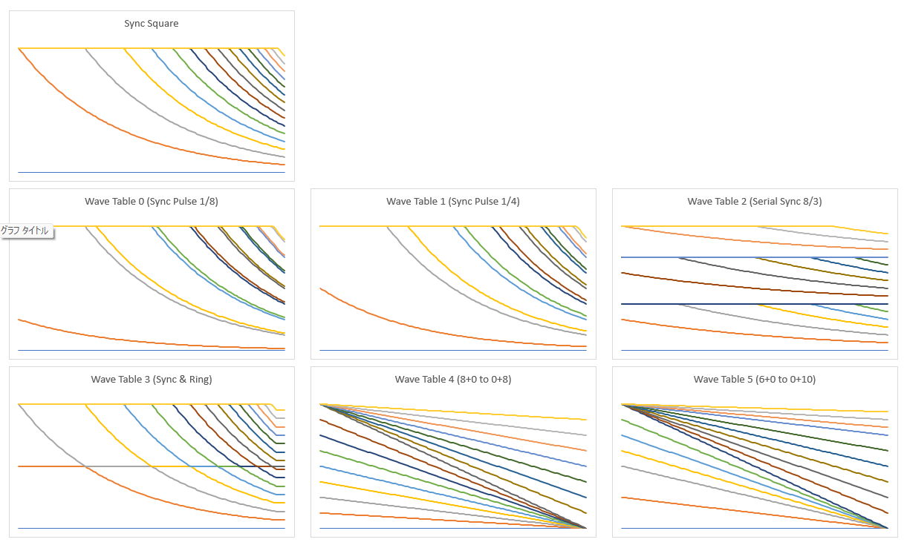

# Digital Synth PRA32-U2 v1.5.0

- 2025-11-01 ISGK Instruments
- <https://github.com/risgk/digital-synth-pra32-u2>


## Overview

- 4 Voice Polyphonic Synthesizer for Raspberry Pi Pico 2/RP2350
    - Built-in Chorus and Delay FX
    - Controlled by MIDI -- PRA32-U2 is a MIDI sound module
    - Having the function of writing the parameters to the user programs and the flash
    - PRA32-U2 is an upgraded model of PRA32-U (for Raspberry Pi Pico/RP2040), but some specifications differ
- Modifiable with Arduino IDE and Arduino-Pico (by Earle F. Philhower, III)
- An **I2S DAC** hardware (e.g. Pimoroni Pico Audio Pack) is required
- Prebuilt UF2 files ("bin")
    - "Digital-Synth-PRA32-U2-Pimoroni-Pico-Audio-Pack.uf2" is for Raspberry Pi Pico and Pimoroni Pico Audio Pack


## [Change History](./PRA32-U2-Change-History.md)


## Preparation for modification

- Please install **Arduino IDE**
    - NOTE: Large noise is generated during the sketch upload if other than Update Method: "Default (UF2)" is used
    - Info: <https://www.arduino.cc/en/software>
- Please install Arduino-Pico = **Raspberry Pi Pico/RP2040/RP2350** (by Earle F. Philhower, III) core
    - Additional Board Manager URL: <https://github.com/earlephilhower/arduino-pico/releases/download/global/package_rp2040_index.json>
    - This sketch is tested with version **5.4.2**: <https://github.com/earlephilhower/arduino-pico/releases/tag/5.4.2>
    - Info: <https://github.com/earlephilhower/arduino-pico>
- Please install Arduino **MIDI Library** (by Francois Best, lathoub)
    - This sketch is tested with version **5.0.2**: <https://github.com/FortySevenEffects/arduino_midi_library/releases/tag/5.0.2>
    - Info: <https://github.com/FortySevenEffects/arduino_midi_library>


## Features

### MIDI (Input)

#### USB MIDI Device (Default)

- MIDI Device Name: "Digital Synth PRA32-U2"
- NOTE: Select USB Stack: "Adafruit TinyUSB" in the Arduino IDE "Tools" menu


#### UART MIDI (Optional)

- UART MIDI can also be used
    - Noise caused by USB communication can be avoided
- Uncomment out `//#define PRA32_U2_USE_UART_MIDI` in "Digital-Synth-PRA32-U2.ino"
  and modify `PRA32_U2_UART_MIDI_SPEED`, `PRA32_U2_UART_MIDI_TX_PIN`, and `PRA32_U2_UART_MIDI_RX_PIN`
    - Speed: 31250 bps (default, for DIN/TRS MIDI) or 38400 bps (for PC)
    - GP4 and GP5 pins are used by UART1 TX and UART1 RX by default
- DIN/TRS MIDI is available by using (and modifying) Adafruit MIDI FeatherWing Kit, for example
    - Adafruit [MIDI FeatherWing Kit](https://www.adafruit.com/product/4740) (Product ID: 4740)
    - M5Stack [Midi Unit with DIN Connector (SAM2695)](https://shop.m5stack.com/products/midi-unit-with-din-connector-sam2695) (SKU: U187) in Separate mode
    - Kinoshita Laboratory [MIDI-UART interface-san Kit](https://www.tindie.com/products/kinoshitalab/midi-uart-interface-san-kit/)
    - 木下研究所 [MIDI-UARTインターフェースさん キット](https://www.switch-science.com/products/8117) (Shipping to Japan only)
    - necobit電子 [MIDI Unit for GROVE](https://necobit.com/denshi/grove-midi-unit/) (Shipping to Japan only)
    - necobit電子 [MIDI Unit Mini for GROVE](https://necobit.com/denshi/midi-unit-mini-for-grove/) (Shipping to Japan only)
- We recommend using [Hairless MIDI<->Serial Bridge](https://projectgus.github.io/hairless-midiserial/) on PC
    - On Windows, We recommend using [loopMIDI](https://www.tobias-erichsen.de/software/loopmidi.html) (virtual loopback MIDI cable)
    - On Mac, a virtual MIDI bus (port) can be created by using the IAC bus


### Audio (Output)

#### I2S (Default)

- Use an I2S DAC (Texas Instruments PCM5100A, PCM5101A, or PCM5102A is recommended), Sampling Rate: 48 kHz, Bit Depth: 16 bit
- NOTE: The RP2350 system clock (sysclk) changes to overclocked 153.6 MHz by I2S Audio Library setSysClk()
- Modify `PRA32_U2_I2S_DAC_MUTE_OFF_PIN`, `PRA32_U2_I2S_DATA_PIN`, `PRA32_U2_I2S_MCLK_PIN`, `PRA32_U2_I2S_MCLK_MULT`,
  `PRA32_U2_I2S_BCLK_PIN`, `PRA32_U2_I2S_SWAP_BCLK_AND_LRCLK_PINS`, and `PRA32_U2_I2S_SWAP_LEFT_AND_RIGHT`
  in "Digital-Synth-PRA32-U2.ino" to match the hardware configuration
    - Define `PRA32_U2_I2S_DAC_MUTE_OFF_PIN` and connect this pin to the I2S DAC mute off pin to reduce click noise when writing the parameters to the flash
- The default setting is for Pimoroni [Pico Audio Pack](https://shop.pimoroni.com/products/pico-audio-pack) (PIM544)
    - [Adafruit PCM5102 I2S DAC](https://www.adafruit.com/product/6250) (Product ID: 6250), [Adafruit PCM5100 I2S DAC](https://www.adafruit.com/product/6251) (Product ID: 6251), and GY-PCM5102 (PCM5102A I2S DAC Module) can also be used
```
#define PRA32_U2_I2S_DAC_MUTE_OFF_PIN          (22)
#define PRA32_U2_I2S_DATA_PIN                  (9)
//#define PRA32_U2_I2S_MCLK_PIN                  (0)
//#define PRA32_U2_I2S_MCLK_MULT                 (0)
#define PRA32_U2_I2S_BCLK_PIN                  (10)  // LRCLK Pin is PRA32_U2_I2S_BCLK_PIN + 1
#define PRA32_U2_I2S_SWAP_BCLK_AND_LRCLK_PINS  (false)
#define PRA32_U2_I2S_SWAP_LEFT_AND_RIGHT       (false)
```
- The following is setting is for [Pimoroni Pico VGA Demo Base](https://shop.pimoroni.com/products/pimoroni-pico-vga-demo-base) (PIM553)
```
//#define PRA32_U2_I2S_DAC_MUTE_OFF_PIN          (0)
#define PRA32_U2_I2S_DATA_PIN                  (26)
//#define PRA32_U2_I2S_MCLK_PIN                  (0)
//#define PRA32_U2_I2S_MCLK_MULT                 (0)
#define PRA32_U2_I2S_BCLK_PIN                  (27)  // LRCLK Pin is is PRA32_U2_I2S_BCLK_PIN + 1
#define PRA32_U2_I2S_SWAP_BCLK_AND_LRCLK_PINS  (false)
#define PRA32_U2_I2S_SWAP_LEFT_AND_RIGHT       (false)
```
- The following is setting is for [Waveshare Pico-Audio](https://www.waveshare.com/wiki/Pico-Audio) Rev2.1 Version (WAVESHARE-20167)
```
//#define PRA32_U2_I2S_DAC_MUTE_OFF_PIN          (0)
#define PRA32_U2_I2S_DATA_PIN                  (22)
#define PRA32_U2_I2S_MCLK_PIN                  (26)
#define PRA32_U2_I2S_MCLK_MULT                 (256)
#define PRA32_U2_I2S_BCLK_PIN                  (27)  // LRCLK Pin is is PRA32_U2_I2S_BCLK_PIN + 1
#define PRA32_U2_I2S_SWAP_BCLK_AND_LRCLK_PINS  (true)
#define PRA32_U2_I2S_SWAP_LEFT_AND_RIGHT       (true)
```


#### PWM Audio (Optional) (CURRENTLY NOT RECOMMENDED)

- PWM Audio can also be used instead of I2S (PWM Audio does not require an I2S DAC hardware)
    - NOTE: Probably smaller output volume than I2S DAC boards
    - NOTE: To avoid noise, the parameters will not be written to the flash when using PWM audio
    - We recommend adding RC filter (post LPF) circuits to reduce PWM ripples
        - A 1st-order LPFs with a cutoff frequency 7.2 kHz (R = 220 ohm, C = 100 nF) works well
    - See "PWM audio" in [Hardware design with RP2040](https://datasheets.raspberrypi.com/rp2040/hardware-design-with-rp2040.pdf)
      for details on PWM audio
- NOTE: Select CPU Speed: "150 MHz" in the Arduino IDE "Tools" menu
- Uncomment out `//#define PRA32_U2_USE_PWM_AUDIO_INSTEAD_OF_I2S`
  in "Digital-Synth-PRA32-U2.ino" and modify `PRA32_U2_PWM_AUDIO_L_PIN` and `PRA32_U2_PWM_AUDIO_R_PIN`
- The following is setting is for Pimoroni Pico VGA Demo Base (PIM553)
```
#define PRA32_U2_PWM_AUDIO_L_PIN               (28)
#define PRA32_U2_PWM_AUDIO_R_PIN               (27)
```
- KNOWN ISSUE: When using PWM Audio, signal discontinuity (missing a sample) occurs about every 80 ms in each L and R channel
    - Click noise is particularly noticeable in the high frequency band and sine waves


## Files

- "Digital-Synth-PRA32-U2.ino" is a Arduino sketch for Raspberry Pi Pico/RP2040/RP2350 core
    - Modify `PRA32_U2_MIDI_CH` to change the MIDI Channel
- "pra32-u2-make-sample-wav-file.cc" is for debugging on PC
    - GCC (g++) for PC is required
    - "pra32-u2-make-sample-wav-file-cc.bat" makes a sample WAV file (working on Windows)
- "pra32-u2-generate-*.rb" generates source or header files
    - A Ruby execution environment is required


## PRA32-U2 Editor

- "pra32-u2-editor.html": Editor (MIDI Controller) Application for PRA32-U2, HTML App (Web App)
    - Modify `PRA32_U2_MIDI_CH` to change the MIDI Channel
- We recommend using Google Chrome, which implements Web MIDI API
- Select "Digital Synth PRA32-U2" in the list "MIDI Out"
- Functions
    - PRA32-U2 Editor converts Program Changes (#0-7 for user presets, #8-15 for factory presets) into Control Changes
    - When Program Change #127 is entered or Control Change #111 is changed from Off (63 or lower) to On (64 or higher), "Random Synth" is processed
    - PRA32-U2 Editor stores the current control values and the user presets (#0-7) in a Web browser (localStorage)
    - Current parameter values and user presets (#0-7) can be imported/exported from/to JSON files
- When not using PRA32-U2 Editor
    - PRA32-U2 can also be controlled by MIDI without using PRA32-U2 Editor
    - Refer to "PRA32-U2-MIDI-Implementation-Chart.txt" for the supported functions
    - The default program is #0
    - Programs #0-15 can be modified by editing "pra32-u2-program-table.h"
    - PRA32-U2 Editor functions related to parameter writing
        - Write: Write the current parameters to PRA32-U2 (Program #8-15 and the flash)
        - Program Change: Send Program Change to PRA32-U2 directry
          (NOTE: The current parameters of PRA32-U2 will not be updated)


## Examples of Option Combinations

- PRA32-U2 (USB MIDI Device, I2S), Default
- PRA32-U2 (USB MIDI Device, UART MIDI, I2S)
- PRA32-U2 (USB MIDI Device, PWM Audio) (CURRENTLY NOT RECOMMENDED)
- PRA32-U2 with Panel (USB MIDI Device, UART MIDI, I2S, Control Panel)


## [Parameter Guide](./PRA32-U2-Parameter-Guide.md)


## [MIDI Implementation Chart](./PRA32-U2-MIDI-Implementation-Chart.md)


## Synthesizer Block Diagram


## Wave Table Graphs




## Simple Circuit for PWM Audio (Optional) (CURRENTLY NOT RECOMMENDED)

### Circuit Diagram


- This image was created with Fritzing.
    - Actually, it is necessary to use Raspberry Pi Pico 2 (instead of Raspberry Pi Pico)
- Adding 10 uF electrolytic capacitors (AC coupling capacitors) will cut the DC components of the audio outputs.
- NOTE: Connect an amplifier or an active speaker to the audio jack.
  Connecting a headphone or a passive speaker may cause a large current to flow and damage the devices.


### Actual Wiring Diagram


- This image was created with Fritzing.
    - Actually, it is necessary to use Raspberry Pi Pico 2 (instead of Raspberry Pi Pico)


## [PRA32-U2 with Panel](./README-PRA32-U2-with-Panel.md) (Optional)


## License


**Digital Synth PRA32-U2 v1.5.0 by ISGK Instruments (Ryo Ishigaki)**

To the extent possible under law, ISGK Instruments (Ryo Ishigaki)
has waived all copyright and related or neighboring rights
to Digital Synth PRA32-U2 v1.5.0.

You should have received a copy of the CC0 legalcode along with this
work.  If not, see <http://creativecommons.org/publicdomain/zero/1.0/>.


### For Your Information

If PRA32-U2 is to be embedded in instruments or others, it would be nice
(but not required) to display the following:

- Powered by ISGK Instruments PRA32-U2
- Powered by PRA32-U2
